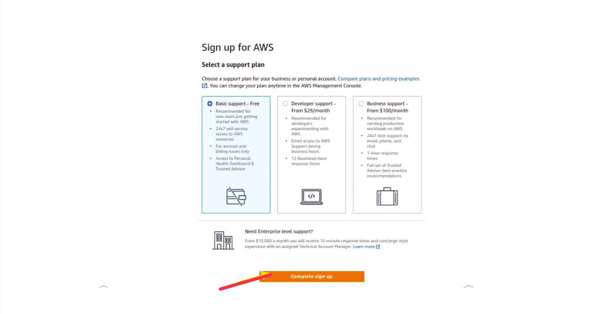

# AWS-Account-Creation
This project introduces you to the process of creating and configuring an AWS account while building a foundational understanding of its core features, practical uses, and the AWS Management Console.

## Understanding The Basics of AWS Cloud
```
- What is Cloud:- Think of the cloud as a library that never closes. Instead of keeping all your books, photos, or files at home where they can get lost or damaged, you place them in this library, which is built on many powerful computers connected through the internet. Whenever you need something, you can simply walk in (log in) and pick it up, no matter where you are. This way, your digital “books” are safe, organized, and always within reach as long as you have internet access.

- What is AWS Cloud:- Amazon Web Services (AWS) is one of the world’s leading cloud providers, alongside others like Microsoft Azure, Google Cloud Platform, and IBM Cloud. A cloud provider is essentially a company that offers online computing services, allowing people and businesses to store data and run applications on their powerful computers instead of buying and maintaining their own hardware. AWS delivers a wide range of services—servers, storage, databases, networking, analytics, artificial intelligence, and more—all accessible over the internet. Think of it as a vast digital infrastructure where anyone, from startups to large corporations, can tap into enterprise-level technology without the need for expensive physical equipment.
```
## Importance of AWS Cloud 
```
The importance of AWS lies in its flexibility, scalability, and cost-effectiveness. In the past, only big companies with huge budgets could afford advanced computing power, but AWS has made these resources available to everyone. For example, if you’re launching an app, you don’t need to purchase expensive servers, memory, or storage upfront. Instead, you can “rent” what you need from AWS and pay only for what you use, thanks to its pay-as-you-go model. If your app becomes popular and demand spikes, you can quickly scale up resources. If demand drops, you can scale down and reduce costs. This adaptability makes AWS a powerful tool for innovation, growth, and experimentation without financial risk.
```
## Setting Up Your AWS Accounts 

- Open The Create AWS Account and click on Create AWS Account


- Enter the valid required details like Email address, Password and AWS account name.
Then click verify email address.
! [](./img/2.create.png)

- Check respective email.
You'll receive a verification code there, copy that verification code.


- Your Email address has been successfully registered.
- Now set Root user password.
- Then click on Continue.


- Now, the registration process will ask your Personal Information.
Enter all the Information and click on continue.


- As per your request, please provide your payment information for verification purposes.
- Rest assured, they will not charge you unless your usage surpasses the AWS Free Tier limits.
- Kindly note that some credit card or debit card companies may authorize a nominal charge of approximately USD $1.00 to validate the card's authenticity, with the charge typically being reversed shortly thereafter. 
- Click on Verify and continue.


- Your payment process will be initiated. Please rest assured that your payment information will be securely processed.


- A One Time Password (OTP) will be sent to the respective phone number for verification purposes.
- Please ensure that you have access to the provided phone number to receive the OTP and complete the verification process.


- Then write this OTP here
  

- To activate your account and confirm your identity.
- you have the option to choose either a Text message (SMS) or a Voice call to receive the verification code.
- Additionally, you will be presented with a CAPTCHA. Please enter the displayed code and proceed to send for verification.


- Please click on the 'Send' button to proceed.  
- Once the verification process is initiated, the verification code will be sent to the respective phone number.
 - Here, we have chosen to receive the verification code via Text message (SMS). Upon receiving the verification code, kindly copy it for further use in the verification process.


- Please click on the 'Send' button to proceed. 
- Once the verification process is initiated, the verification code will be sent to the respective phone number.
- Here, we have chosen to receive the verification code via Text message (SMS). Upon receiving the verification code, kindly copy it for further use in the verification process.


- Please fill in the verification code that you received.
Then click on the 'Continue' button to proceed with the verification process.


- On the 'Select a support plan page, please choose one of the available Support plans.
- Starting with the Basic support - Free option is recommended. Familiarize yourself with the details of each plan before making a selection.
- Once you've chosen the Basic support - Free plan, proceed by selecting 'Complete sign up' to finalize the process. Then choose complete sign up.


- Your Amazon Web Services account has been successfully created.
Please click on 'Go to the AWS Management Console' to access your account.


## Accessing the AWS Management Console using newly created account credentials.

- After completing the setup process, you can access the AWS Management Console using your new AWS account credentials.
- Enter your Personalize Your Experience.
- Click Submit.


- Click Sign in to the Console.


- Select 'Root user' and enter your registered email address.
Then click 'Next' to proceed.


- If a CAPTCHA is presented, please enter the displayed code and then click 'Submit' to proceed.


- Enter your root password.
- click 'Sign In' to proceed.


16.Root-signin

- You have successfully logged in to your Amazon Web Service account.
  

## Practical experience in using AWS services effectively for future projects or business needs.
```
The experience with AWS means not just learning the theory but actually working with its services—like setting up servers, managing storage, deploying applications, or using databases—in real scenarios. This hands-on practice builds confidence, helps you understand how to apply the right tools for specific needs, and prepares you to design efficient, scalable, and cost-effective solutions. Whether for future projects, startups, or larger business operations, this experience ensures you can leverage AWS effectively to support growth and innovation.
```


